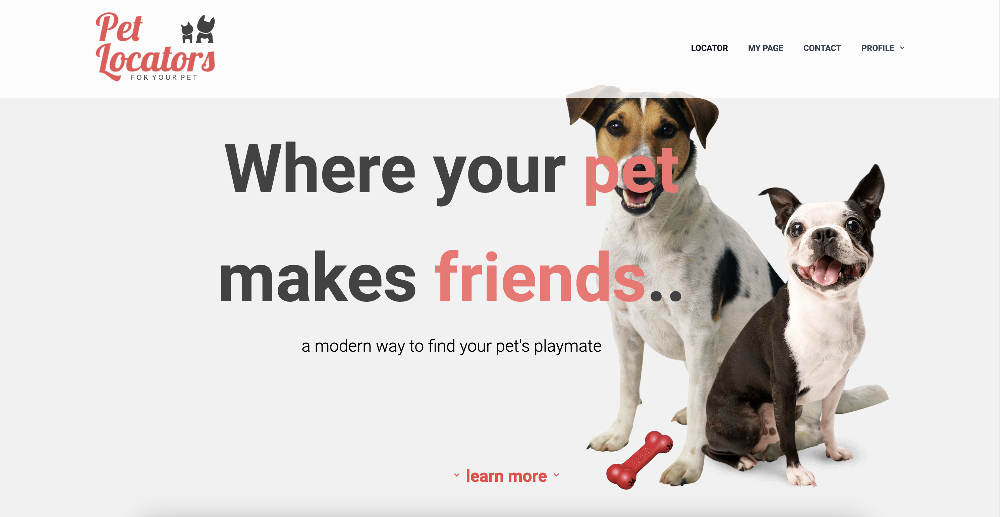

# Pet-locators

## Description

This interactive fullstack web application was created for pet lovers who wish to find a companion for their pet close to their location. The user could use this web application to create a log-in and it will take the user's email and username to create an empty profile. The user could go into the "settings" tab under "profile" on the navigation bar in order to update their profile with their correct name, location, pronoun, contact information, and upload a profile picture. Once their profile is updated, the user could add in their pets and information in regards to their pets using "my page" on the navigation bar. Creating a profile will allow other users to view the user's profile and see their pets as well.

The web application also takes the inputted user's location from their profile and lists other pets that are close by using the "locator" feature on the navigation bar. All of the pets that are close to the user will be displayed on that page. If the user sees a pet close by that they wish to contact, the user could click on their picture and it will take them to that user's profile so they could view their contacts and schedule a meet up.

The user could also contact us using the "contact" feature on the navigation bar if they have any questions or need assistances about our web application.

Here is the link to the repository: https://github.com/jssoyoung/Pet-locators

Here is the link to the deployed application: 

Here is a link to the walkthrough video of our website: 

Here is an image of the website: 

## Installation

No installation is required for this web application. The web application is deployed using Heroku. Click on the link above to access the web application. 

If the user wishes to download the fullstack web application code and run it, then installation is needed. The user will first be required to have a command-line application downloaded onto their computer or laptop. The user must also have node.js installed onto that device and a mysql username. Once they have these two downloaded, the user could type "npm i" into their terminal or window. This should install the packages and dependencies needed to run this project into the user's command-line application. Once these packages and dependencies are finished being installed, the user can type in "mysql -u root" (add -p if the user has a password). The user should input their mysql username and password (if they have one). They will need to type "source db/schema.sql". They could then leave mysql and run the seeds using "npm run seeds". Finally, the user will need to type in "npm start". 

## Authors

Young Jang
https://github.com/jyoungjoon

Dahn Bey
https://github.com/dbey21

Michael Manhxaythavong
https://github.com/mmanhx90

Jessica Yun
https://github.com/jssoyoung

## Usage

This web application is divided into different sections. The header of the web application includes the title, logo and a navigation bar. Within the body section of the web application, there is information in regards to our project such as a list of our features, how our web application works, and some testimonials. If the user clicks on the "sign up/login" button on the navigation bar, there will be a sign up feature pop up. The user could input a username, email, and password to create an account. If they already have a login, they could click the "Already have an account? Log in" button on the bottom of the pop up to input their email and password. Once the user is signed up and logged in, the nagivation bar will change to display "locator", "my page", "contact", and "profile". If the user clicks on the "my page" button on the navigation bar, their user profile will display. Their name and email will automatically be filled in based on their sign up information. The user could click on the "settings" button under the "profile" button the navigation bar if they wish to change any of their information on their profile such as their name, location, pronouns, contact information, or profile picture. If the user updated their contact information, their "my page" will automatically be updated to display all of their information. The user could also click on the "pets" button on their "my page" to add in their pets. If the user does not have any pets or wishes to add another pet, they could click on the "Add pets" button which will redirect them to the "Add pets" page where they could write information in regards to their pets and upload pictures. The web application will use the location that the user input for their profile to display other pets in that area in the "locator" feature on the navigation bar. All the pets near the user will display and if the user sees a pet they wish to find out more information about, they could click on their picture and the web application will redirect them to their user's profile page. They could use the contact information listed to schedule a meet up. The user could also look at other pictures of that pet, like their pictures, and leave comments on their pictures. The "contact" button on the navigation bar is used if a user has any additional questions or wishes additional help on using our web application.
The Google storage API was used to store all of the pictures that users upload onto our web application.

## Credits

* Background Image from 
* Google Storage API from 
* Special thanks to UC Berkeley Coding Boot Camp staff: Samantha (Instructor), Jin Yi (TA), Lalith (TA) and Gunjan (TA) for helping us with this project.

## License

Please refer to the LICENSE in the repo.